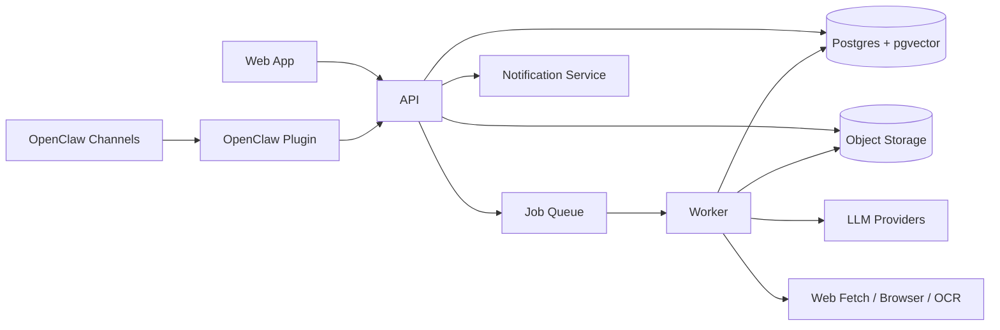
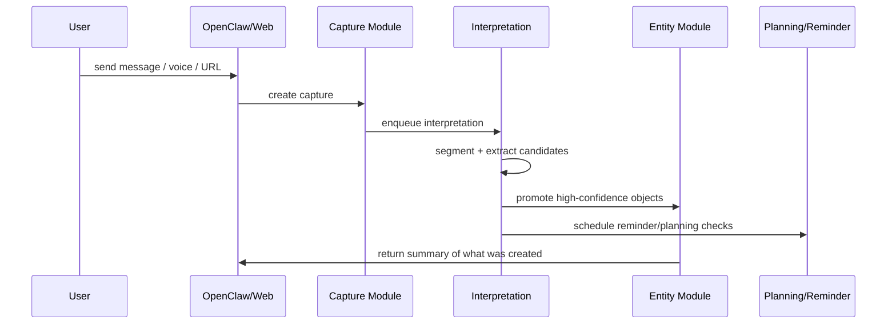

# Application Technical Spec

Last updated: 2026-03-27

## Purpose

This document translates the product design into a concrete application plan.

It answers:

- what to build first
- what services and modules should exist
- how data should be stored
- how OpenClaw fits in
- what APIs and tools the assistant should use

Supporting implementation docs:

- `database-schema-and-migrations-2026-03-27.md`
- `integration-service-contracts-2026-03-27.md`
- `gmail-integration-rfc-v1-2026-03-27.md`
- `calendar-integration-rfc-v1-2026-03-27.md`
- `browser-extension-rfc-v1-2026-03-27.md`
- `notification-endpoints-rfc-v1-2026-03-27.md`
- `core-entity-model-research-2026-03-27.md`
- `ontology-overlap-and-facets-2026-03-27.md`
- `universal-ontology-schema-rfc-2026-03-27.md`
- `master-build-plan-2026-03-27.md`

## Recommended Architecture

### High-level shape

For v1, build a modular monolith with one database and one job queue.

Why:

- the product logic is highly cross-cutting
- capture, planning, reminders, research, and memory all share the same core objects
- premature microservices would slow down iteration and make debugging much harder

Recommended stack:

- frontend: `Next.js`
- backend API: `NestJS` or `Fastify`-based TypeScript app
- database: `Postgres`
- vector search: `pgvector`
- full-text search: Postgres `tsvector`
- job queue: `pg-boss`
- file/blob storage: S3-compatible store or local object storage
- ORM/query layer: `Kysely` or `Drizzle` with SQL migrations
- OpenClaw integration: TypeScript plugin + skill pack

### Storage layer architecture

The repo pass made the storage split much more concrete.

We should explicitly separate 5 layers:

1. canonical object layer
   - entities, actors, contexts, work_items, events, resources, memory_items, rules
   - operational objects like reminders and plans stay explicit, but do not replace the universal root ontology
2. artifact layer
   - attachments, snapshots, preserved files, OCR/readability outputs
3. retrieval layer
   - embeddings, FTS indexes, searchable documents, rerank state
4. temporal/event layer
   - entity events, reminder deliveries, telemetry buckets/events, and other append-only history
5. assistant/runtime layer
   - sessions, workflow runs, action requests, memory summaries

Important implementation rule:

- blobs should be referenced, not stored inline in canonical tables
- artifact-like tables should prefer:
  - `storage_type`
  - `storage_ref`
  - `payload_json`
  - `content_hash`
- retrieval/index state should be rebuildable from canonical/artifact state

Recommended v1 backend choices:

- canonical DB: Postgres
- artifact storage: S3-compatible store or local object store
- retrieval: Postgres FTS + `pgvector`

Recommended v2 escape hatches:

- external search backend adapter like Meilisearch/Tantivy/OpenSearch
- deeper local-first sync semantics beyond offline outbox/replay

### Two-layer execution model

For complex assistant workflows, especially research-heavy ones, we should use:

- layer 1: assistant orchestrator
- layer 2: deterministic backend engines

The assistant layer should:

- parse intent
- choose a workflow profile
- explain its understanding
- call one or a few typed backend workflows
- present results and handle follow-ups

The backend engines should:

- run source adapters
- perform enrichment and normalization
- score and rerank evidence
- dedupe and cluster results
- preserve artifacts and traces
- emit structured outputs

### Repository-grounded design constraints

The repo code review changed a few design decisions from "good ideas" into "non-negotiable requirements":

- Raw captures must be stored separately from promoted entities.
- Long-lived memory needs summary-backed compaction, not only embeddings.
- `Inbox` should be an explicit system object, not only a filtered task state.
- Resource ingestion must preserve multiple artifacts when useful, not only extracted text.
- Reminder execution should live in a worker.
- Planning views should be derived from task/calendar/reminder state.
- External writes should go through an approval-backed action-request flow.
- OpenClaw integration must support explicit session/channel bindings.
- The runtime should distinguish `tools`, `actions`, `workflows`, and `background jobs`.
- Browser or UI automations should prefer semantic targets + verification over raw selectors.
- Research should produce reusable evidence bundles, not only one-shot answers.
- Working memory, long-term memory, and procedural/assistant-rule memory should stay separate.
- The orchestrator should delegate to bounded workflow profiles instead of broad autonomous swarms.
- The personal-assistant ontology should use a shared `entities` registry with universal physical tables: `actors`, `contexts`, `work_items`, `events`, `resources`, `memory_items`, and `rules`, with narrower concepts exposed as subtype-based views.

### Monorepo layout

```text
apps/
  web/
  api/
  worker/
  browser-extension/
  openclaw-plugin/
packages/
  domain/
  db/
  prompts/
  retrieval/
  workflows/
  integrations/
  sdk/
  ui/
infra/
  docker/
  migrations/
docs/
```

### System diagram



## Core Modules

The backend should be modular even if deployed as one application.

### 1. Capture module

Responsibilities:

- receive raw text, voice transcripts, URLs, files, chat messages, and imported content
- normalize metadata
- store raw captures, capture events, and attachments
- enqueue interpretation jobs
- maintain inbox/review state for newly arrived material

Owned data:

- `capture_sessions`
- `capture_events`
- `capture_parts`
- `capture_segments`
- `attachments`
- `inbox_items`

### 2. Interpretation module

Responsibilities:

- segment captures
- extract candidate tasks, people, dates, projects, rules, resources, and questions
- assign confidence
- resolve simple deterministic signals
- queue promotion decisions

Owned data:

- `extractions`
- `candidate_entities`

### 3. Entity module

Responsibilities:

- own canonical entity identity
- create and update promoted objects
- maintain relations and source links
- provide entity read/write APIs

Owned data:

- `entities`
- `entity_relations`
- type-specific tables

### 4. Planning module

Responsibilities:

- derive `Inbox`, `Today`, `Now`, `This Week`, and `Waiting`
- compute task scores
- propose realistic daily plans
- track planned vs actual

Owned data:

- `plans`
- `plan_items`
- planning-related events

Important note:

- planner views should be projections first
- accepted user plans can be snapshotted
- task truth should remain in task/reminder/calendar state

### 5. Reminder module

Responsibilities:

- schedule reminders
- fire reminders
- handle snoozes/escalations
- create follow-up reminders for commitments and waiting-on items

Owned data:

- `reminders`
- `reminder_deliveries`
- `reminder_events`

### 6. Research module

Responsibilities:

- ingest URLs/files into research runs
- resolve entities and aliases before expensive retrieval
- fetch/snapshot/extract content
- run profile-specific source strategies
- normalize, score, dedupe, and cross-link evidence
- synthesize grounded briefs
- create derived artifacts like tasks or watch items
- preserve source artifacts for later reuse and verification
- support follow-ups over saved evidence bundles
- support multi-pass research workflows where the orchestrator delegates bounded sub-research tasks

Owned data:

- `research_runs`
- `research_steps`
- `research_evidence_items`
- `research_evidence_links`
- `research_resolved_entities`
- `research_sources`
- `research_briefs`
- `resource_snapshots`
- `resource_artifacts`

Important note:

- research should be implemented as profile-specific workflows such as:
  - `company_prep`
  - `tool_comparison`
  - `decision_support`
  - `product_watch`
  - `topic_brief`
- a follow-up question should usually read from prior `research_runs` and `research_briefs` before triggering a fresh run

### 7. Memory / retrieval module

Responsibilities:

- full-text and semantic retrieval
- curated memory items
- summary-backed long-horizon memory
- source-backed answer context assembly
- related-content lookup
- working-memory injection for short-horizon continuity
- procedural rules / assistant behavior memory

Owned data:

- `memory_items`
- `memory_summaries`
- `memory_summary_edges`
- `memory_context_items`
- `embeddings`
- retrieval indexes
- `working_memory_items`
- `procedural_rules`

Important note:

- memory should be layered:
  - raw history
  - working memory
  - long-term semantic memory
  - summary DAG / compaction state
  - research/evidence memory

### 8. People / interactions module

Responsibilities:

- track people entities
- track conversations, commitments, and waiting-on state
- attach context to meetings and follow-ups

Owned data:

- `people`
- `conversations`
- `commitments`

### 9. Integrations module

Responsibilities:

- manage provider definitions and user connections
- manage OAuth sessions and encrypted credentials
- run calendar, email, and contact read syncs
- resolve and merge actor identities from those feeds with explicit review controls
- manage sync cursors, provider watch channels, and webhook receipts
- normalize imported external records into source-linked context
- manage notification endpoints and delivery logs
- stage future external actions behind approval-backed action requests

Owned data:

- `provider_definitions`
- `connections`
- `oauth_sessions`
- `connection_credentials`
- `connection_tags`
- `sync_cursors`
- `webhook_channels`
- `inbound_webhook_events`
- `external_object_refs`
- `notification_endpoints`
- `notification_preferences`
- `notification_deliveries`
- `external_events`
- `external_messages`

### 10. Assistant integration module

Responsibilities:

- expose internal capabilities as OpenClaw tools
- manage OpenClaw session/context policy
- translate chat actions into backend commands
- manage pending approvals and resumable action flows

Owned data:

- `assistant_sessions`
- `channel_bindings`
- `action_requests`
- operational traces

## Canonical Data Model

The product should use a shared entity registry plus specialized tables.

### Raw capture log

This sits below the entity layer.

Not every capture becomes an entity, but every important entity should point back to one or more captures.

#### `capture_sessions`

- `id`
- `source_kind`
- `source_account_id`
- `source_conversation_id`
- `source_thread_key`
- `assistant_session_id`
- `created_at`
- `updated_at`

#### `capture_events`

- `id`
- `session_id`
- `event_kind`
- `role`
- `raw_text`
- `raw_payload_json`
- `attachment_count`
- `created_at`

#### `capture_parts`

- `id`
- `capture_event_id`
- `part_kind`
- `ordinal`
- `text_content`
- `tool_name`
- `tool_input_json`
- `tool_output_json`
- `metadata_json`

### Inbox state

`Inbox` needs to support captures, candidates, approvals, and resources in one place.

#### `inbox_items`

- `id`
- `item_kind`
- `capture_event_id`
- `entity_id`
- `action_request_id`
- `status`
- `reason`
- `priority`
- `created_at`
- `updated_at`

### Entity registry

`entities`

Core fields:

- `id`
- `kind`
- `title`
- `status`
- `source_capture_id`
- `confidence`
- `created_at`
- `updated_at`
- `archived_at`

Why this layer exists:

- one identity space across all objects
- easier relation graph
- easier events and embeddings
- easier source/provenance tracking
- lets us promote only the things that deserve canonical status

### Type-specific tables

#### `tasks`

- `entity_id`
- `priority`
- `importance`
- `urgency`
- `scheduled_day`
- `scheduled_at`
- `deadline_day`
- `deadline_at`
- `start_after`
- `planned_for`
- `estimate_minutes`
- `effort_size`
- `energy_required`
- `waiting_on_person_id`
- `blocked_reason`
- `completion_mode`

#### `projects`

- `entity_id`
- `horizon`
- `goal_entity_id`
- `active`
- `health`
- `review_cadence`

#### `reminders`

- `entity_id`
- `target_entity_id`
- `trigger_type`
- `trigger_at`
- `trigger_rules`
- `delivery_channel`
- `escalation_policy`
- `snoozed_until`
- `completed_at`

#### `resources`

- `entity_id`
- `resource_kind`
- `original_url`
- `file_ref`
- `mime_type`
- `snapshot_status`
- `extracted_text_ref`
- `metadata_json`

#### `resource_snapshots`

- `id`
- `resource_entity_id`
- `snapshot_kind`
- `fetch_status`
- `fetch_url`
- `http_status`
- `content_hash`
- `metadata_json`
- `created_at`

#### `resource_artifacts`

- `id`
- `snapshot_id`
- `artifact_kind`
- `storage_type`
- `storage_ref`
- `mime_type`
- `size_bytes`
- `content_hash`
- `text_ref`
- `payload_json`
- `derived_from_artifact_id`
- `metadata_json`
- `created_at`

#### `people`

- `entity_id`
- `display_name`
- `aliases`
- `email_addresses`
- `phone_numbers`
- `relationship_tags`
- `last_interaction_at`

#### `events`

- `entity_id`
- `starts_at`
- `ends_at`
- `location`
- `calendar_source`
- `external_event_ref`

#### `rules`

- `entity_id`
- `scope`
- `instruction`
- `priority`
- `active`

#### `memory_items`

- `entity_id`
- `memory_type`
- `content`
- `last_verified_at`
- `stability_score`

#### `research_runs`

- `entity_id`
- `query`
- `status`
- `run_type`
- `workflow_profile`
- `freshness_window`
- `started_at`
- `completed_at`
- `summary_entity_id`

#### `research_steps`

- `id`
- `research_run_entity_id`
- `ordinal`
- `step_kind`
- `status`
- `tool_name`
- `input_json`
- `output_json`
- `status_message`
- `created_at`

#### `research_resolved_entities`

- `id`
- `research_run_entity_id`
- `entity_kind`
- `canonical_name`
- `alias`
- `handle`
- `url`
- `confidence`
- `metadata_json`

#### `research_evidence_items`

- `id`
- `research_run_entity_id`
- `source_type`
- `external_id`
- `title`
- `snippet`
- `url`
- `published_at`
- `author`
- `score`
- `raw_payload_json`
- `normalized_json`
- `created_at`

#### `research_evidence_links`

- `id`
- `research_run_entity_id`
- `from_evidence_id`
- `to_evidence_id`
- `link_type`
- `weight`
- `metadata_json`

### Shared supporting tables

#### `entity_relations`

- `id`
- `from_entity_id`
- `relation_type`
- `to_entity_id`
- `metadata_json`
- `created_at`

#### `entity_events`

- `id`
- `entity_id`
- `event_type`
- `actor_type`
- `actor_ref`
- `payload_json`
- `created_at`

For opt-in passive life-tracking or device-context ingestion in v1:

#### `telemetry_buckets`

- `id`
- `bucket_key`
- `source`
- `user_id`
- `workspace_id`
- `metadata_json`
- `created_at`

#### `telemetry_events`

- `id`
- `bucket_id`
- `starts_at`
- `ends_at`
- `payload_json`
- `source_ref`
- `created_at`

#### `provider_definitions`

- `id`
- `provider_key`
- `display_name`
- `category`
- `auth_mode`
- `supports_webhooks`
- `supports_incremental_sync`
- `supports_actions`
- `default_read_scopes_json`
- `default_write_scopes_json`
- `capabilities_json`

#### `connections`

- `id`
- `provider_definition_id`
- `user_id`
- `workspace_id`
- `status`
- `external_account_id`
- `display_name`
- `granted_scopes_json`
- `connection_metadata_json`
- `last_validated_at`
- `last_sync_at`
- `last_error_at`
- `last_error_code`
- `last_error_message`
- `created_at`
- `updated_at`

#### `oauth_sessions`

- `id`
- `provider_definition_id`
- `connection_id`
- `state_token`
- `redirect_uri`
- `callback_url`
- `pkce_code_verifier`
- `request_token_secret`
- `state_payload_json`
- `status`
- `exchanged_at`
- `expires_at`
- `created_at`

#### `connection_credentials`

- `id`
- `connection_id`
- `credential_version`
- `credential_kind`
- `encrypted_payload`
- `key_version`
- `is_active`
- `rotated_at`
- `expires_at`
- `refresh_after`
- `created_at`

#### `connection_tags`

- `id`
- `connection_id`
- `tag_key`
- `tag_value`

#### `sync_cursors`

- `id`
- `connection_id`
- `stream_key`
- `cursor_kind`
- `checkpoint_json`
- `full_resync_required`
- `cursor_obtained_at`
- `cursor_expires_at`
- `updated_at`

#### `webhook_channels`

- `id`
- `connection_id`
- `stream_key`
- `provider_channel_id`
- `provider_resource_id`
- `provider_resource_uri`
- `routing_token`
- `expires_at`
- `status`
- `last_renewed_at`
- `created_at`

#### `inbound_webhook_events`

- `id`
- `provider_key`
- `connection_id`
- `webhook_channel_id`
- `event_kind`
- `dedupe_key`
- `signature_valid`
- `headers_json`
- `payload_json`
- `received_at`
- `processed_at`
- `processing_status`
- `error_json`

#### `external_object_refs`

- `id`
- `entity_id`
- `connection_id`
- `object_type`
- `external_id`
- `external_parent_id`
- `etag`
- `source_url`
- `raw_metadata_json`
- `last_seen_at`

#### `notification_endpoints`

- `id`
- `user_id`
- `endpoint_type`
- `display_name`
- `endpoint_ref`
- `endpoint_config_json`
- `is_default`
- `is_disabled`
- `last_seen_at`
- `created_at`

#### `notification_preferences`

- `id`
- `user_id`
- `event_key`
- `channel_policy_json`
- `quiet_hours_json`
- `digest_policy_json`

#### `notification_deliveries`

- `id`
- `reminder_id`
- `action_request_id`
- `endpoint_id`
- `delivery_kind`
- `payload_json`
- `status`
- `provider_message_id`
- `dedupe_key`
- `attempt_count`
- `next_attempt_at`
- `sent_at`
- `acknowledged_at`
- `error_json`
- `created_at`
- `resolved_at`

#### `action_requests`

- `id`
- `assistant_session_id`
- `requested_by`
- `target_entity_id`
- `connection_id`
- `capability_key`
- `tool_name`
- `arguments_json`
- `preview_json`
- `risk_level`
- `status`
- `approval_required`
- `idempotency_key`
- `approval_expires_at`
- `requested_at`
- `executed_at`
- `resolved_at`
- `resolution_json`
- `executor_ref`

#### `assistant_sessions`

- `id`
- `channel`
- `account_id`
- `conversation_id`
- `thread_key`
- `workspace_ref`
- `status`
- `created_at`
- `updated_at`

#### `channel_bindings`

- `id`
- `channel`
- `account_id`
- `conversation_id`
- `thread_key`
- `assistant_session_id`
- `route_policy`
- `permissions_policy`
- `created_at`
- `updated_at`

#### `source_links`

- `id`
- `entity_id`
- `capture_id`
- `capture_segment_id`
- `resource_snapshot_id`
- `link_type`

#### `embeddings`

- `id`
- `entity_id`
- `source_type`
- `source_ref`
- `chunk_index`
- `content`
- `embedding`
- `tsvector`

#### `tags`

- `id`
- `name`

#### `entity_tags`

- `entity_id`
- `tag_id`

## State Models

### Capture state

- `NEW`
- `SEGMENTED`
- `EXTRACTED`
- `PROMOTED`
- `ARCHIVED`

### Task state

- `INBOX`
- `READY`
- `PLANNED`
- `IN_PROGRESS`
- `WAITING`
- `DONE`
- `CANCELLED`

Task scheduling semantics:

- `scheduled_day` and `scheduled_at` are mutually exclusive
- `deadline_day` and `deadline_at` are mutually exclusive
- day-level scheduling is not equivalent to exact-time scheduling

### Reminder state

- `ACTIVE`
- `SNOOZED`
- `FIRED`
- `COMPLETED`
- `CANCELLED`

### Research run state

- `QUEUED`
- `FETCHING`
- `EXTRACTING`
- `SYNTHESIZING`
- `READY`
- `FAILED`

## Capture Pipeline

This is the most important runtime flow in the product.



### Pipeline steps

1. Persist raw capture immediately.
2. Normalize attachments and metadata.
3. Segment by structure:
   - lines
   - bullets
   - paragraphs
   - URLs
   - checklist items
4. Run deterministic extraction:
   - URLs
   - checkboxes
   - explicit dates
   - @mentions / person references
5. Run LLM extraction for:
   - tasks
   - projects
   - rules
   - resources
   - open questions
6. Merge deterministic and model-derived candidates.
7. Apply promotion policy.
8. Emit user-facing result summary.

## Promotion Policy

The system should not promote everything.

### Promote automatically when

- actionability is high
- confidence is high
- user intent is obvious
- downstream behavior depends on it soon

Examples:

- explicit reminder request
- task with due date
- interview prep for tomorrow
- obvious task checklist items

### Keep as candidate when

- ambiguous person mention
- fuzzy project idea
- uncertain date
- informational snippet without immediate behavior

### Candidate review queue

The `Inbox` should show:

- unresolved candidates
- low-confidence parses
- items needing a choice
- pending approvals
- fresh resources awaiting classification

## Planning Engine

The planning engine should generate views, not just store lists.

### Derived views

- `Inbox`
- `Today`
- `Now`
- `This Week`
- `Waiting`
- `Backlog`

### Task scoring inputs

- due proximity
- explicit priority
- goal/project relevance
- waiting/blocked state
- estimated effort
- calendar availability
- recent neglect
- user-marked importance

### Simple v1 scoring heuristic

```text
score =
  due_score +
  importance_score +
  urgency_score +
  project_focus_bonus +
  stale_bonus -
  blocked_penalty -
  oversized_penalty
```

### Daily planning behavior

1. Start with today's due and time-bound items.
2. Reserve capacity based on calendar.
3. Fill remaining capacity with highest-value ready tasks.
4. Avoid overfilling.
5. Push overflow back to `This Week`.

Repository-grounded rule:

- do not make the planner a parallel source of truth
- derive it from tasks, reminders, repeats, and calendar state
- persist only accepted/edited plan snapshots

### Planned vs actual

Store:

- planned start time
- planned duration
- actual start
- actual completion
- completion confidence

This becomes the basis for review and future planning improvements.

## Reminder Engine

The reminder engine is not just cron + notifications.

### Reminder types

- explicit time-based
- event-relative
- follow-up based
- recurring
- conditional

### Reminder examples

- 1 day before interview
- 30 minutes before event
- 3 days after sending a message if no reply
- every weekday morning for workout routine

### Reminder behaviors

- message includes context
- reminder links back to task/project/source
- snooze options are short and ergonomic
- repeated snoozes increase escalation or trigger reframing

Repository-grounded rule:

- reminder scheduling/execution should live in a worker process
- API requests should create or update reminder state, not fire reminders inline

### Escalation example

If the same reminder is snoozed 3 times:

- suggest breaking the task down
- suggest rescheduling
- ask whether to deprioritize or drop

## Research Pipeline

Research should be durable and reusable.

### Input types

- direct question
- URL
- document/PDF
- "compare X vs Y"
- "prepare me for interview/company"

### Pipeline

1. Create `research_run`.
2. Parse intent into a workflow profile.
3. Run cheap preflight entity resolution when the subject is entity-like.
4. Fetch or import sources.
5. Store snapshots and preserved artifacts.
6. Normalize evidence into a shared model.
7. Apply profile-aware scoring, freshness filtering, dedupe, and clustering.
8. Optionally run second-pass drilldown searches from extracted entities.
9. Chunk and embed as needed.
10. Extract facts, themes, and open questions.
11. Synthesize final brief.
12. Optionally create:
   - tasks
   - reminders
   - project links
   - watch items

### Workflow profiles

Initial profile set:

- `company_prep`
- `tool_comparison`
- `resource_summary`
- `how_to`
- `decision_support`
- `product_watch`
- `person_brief`

Each profile should define:

- source adapters
- query templates
- freshness tolerance
- scoring weights
- output sections

### Research follow-up behavior

Follow-up questions should bind to the previous run's evidence bundle when possible.

Only rerun retrieval when:

- the user asks for an update
- the evidence is stale for the profile
- the follow-up requires sources that were not previously collected

### Research output schema

- short answer
- detailed summary
- tradeoffs
- citations
- open questions
- suggested next actions

Optional profile-specific sections:

- criteria matrix
- chronology
- corroboration notes
- unresolved contradictions
- recommended follow-up searches

Repository-grounded rule:

- every research answer should be traceable back to step logs and preserved artifacts
- URL ingestion should preserve source evidence, not only generated summaries

## Context Assembly

The assistant should use retrieval over layered data, not giant prompt stuffing.

### Context layers

#### Stable layer

- active rules
- long-term memory items
- user preferences

#### Situational layer

- active tasks
- today's plan
- upcoming events
- active projects
- waiting-on items

#### Query layer

- relevant captures
- linked resources
- related people
- recent interactions
- expandable summary nodes for older history

#### External current layer

- calendar context
- email context
- fresh web research if needed

### Context budget policy

Prefer:

- recent raw evidence
- promoted operational objects
- concise curated memory

Avoid:

- dumping entire note histories
- generic summaries without links

Repository-grounded rule:

- keep a fresh raw tail for recent activity
- compact older material into summary nodes
- allow explicit expansion when the assistant needs more detail

## OpenClaw Integration Plan

OpenClaw is the assistant shell and transport/runtime layer.

### v1 integration model

- OpenClaw plugin calls our backend API
- OpenClaw skill pack instructs the assistant on tool usage
- channel plugins provide capture/reminder delivery
- OpenClaw sessions should map to our `assistant_sessions` and never become the canonical storage layer
- our backend remains canonical
- session bindings live in our backend
- external writes can round-trip through approval-backed action requests

### v1 OpenClaw tools

- `capture_input`
- `get_inbox`
- `get_today_plan`
- `create_task`
- `complete_task`
- `set_reminder`
- `snooze_reminder`
- `search_memory`
- `expand_memory_node`
- `get_project_context`
- `run_research`
- `ingest_resource`
- `list_waiting_on`
- `explain_item_origin`
- `approve_action_request`
- `reject_action_request`

### v2 OpenClaw additions

- custom context engine
- deeper hook-based tracing
- proactive agent workflows
- richer channel-specific control surfaces
- follow-up-over-evidence sessions

## API Surface

The web app and OpenClaw plugin should hit the same backend.

### Core API groups

#### Captures

- `POST /captures`
- `GET /captures/:id`
- `POST /captures/:id/reprocess`

#### Tasks

- `POST /tasks`
- `PATCH /tasks/:id`
- `POST /tasks/:id/complete`
- `POST /tasks/:id/defer`
- `GET /views/today`
- `GET /views/inbox`

#### Reminders

- `POST /reminders`
- `POST /reminders/:id/snooze`
- `POST /reminders/:id/complete`

#### Resources

- `POST /resources/ingest`
- `GET /resources/:id`
- `GET /resources/:id/snapshots`
- `GET /resource-snapshots/:id/artifacts`

#### Research

- `POST /research-runs`
- `GET /research-runs/:id`
- `GET /research-runs/:id/steps`
- `GET /research-runs/:id/evidence`
- `POST /research-runs/:id/followup`
- `POST /watchlists`
- `POST /briefings`

#### Memory

- `GET /search`
- `GET /entities/:id/origin`
- `GET /entities/:id/context`
- `GET /memory-summaries/:id/expand`

#### Assistant actions

- `POST /action-requests/:id/approve`
- `POST /action-requests/:id/reject`
- `GET /assistant-sessions/:id`

#### Integrations

- `POST /connections/:provider/connect`
- `GET /connections`
- `GET /connections/:id`
- `POST /connections/:id/reconnect`
- `GET /connections/:id/sync-status`
- `POST /integrations/gmail/webhook`
- `POST /integrations/calendar/webhook`
- `POST /integrations/browser-extension/capture`
- `POST /telemetry/events`

#### Notifications

- `POST /notification-endpoints`
- `GET /notification-endpoints`
- `PATCH /notification-endpoints/:id`
- `GET /notification-deliveries`

#### Planning

- `POST /plans/generate`
- `GET /plans/today`
- `POST /plans/today/accept`

## Frontend Screens

The web app should start with a small number of excellent screens.

### 1. Inbox

Contains:

- new captures
- unresolved candidates
- items needing confirmation
- newly ingested resources

### 2. Today

Contains:

- current plan
- urgent reminders
- next best actions
- quick complete/defer/snooze actions

### 3. Projects

Contains:

- active projects
- linked tasks/resources/people
- health and momentum indicators

### 4. Research

Contains:

- resource library
- research runs
- briefs
- open questions

### 5. People

Contains:

- tracked people
- follow-ups
- recent commitments
- last interaction context

### 6. Settings / Rules

Contains:

- assistant behavior rules
- notification channels
- integration/account setup

## Security / Privacy Model

### Principles

- our backend owns sensitive user data
- external writes require approval by default
- every external account has scoped permissions
- raw captures and attachments must be access-controlled

### Approval policy

Safe to do automatically:

- read calendar, email, and contacts
- perform full or incremental sync jobs
- send internal reminders and in-app notifications
- generate internal plans, drafts, and suggested actions
- create internal entities from imported context

Require approval:

- send email
- create or modify calendar event
- send outbound message to another human
- browser actions with side effects
- any external write on a connection that is not explicitly preapproved

## Deployment Recommendation

### Local-first dev and self-hosted-friendly prod

Recommended deployment units:

- `web`
- `api`
- `worker`
- `postgres`
- `object-storage`
- `openclaw-gateway`

### First deployment target

Use Docker Compose for local/dev and one simple production environment first.

Avoid:

- multi-cloud complexity
- splitting every module into separate services immediately

## What To Build First

If we optimize for the fastest path to product truth, build in this order:

1. capture + raw storage
2. extraction + promotion
3. tasks + reminders
4. Inbox + Today views
5. memory search + source-backed answers
6. research runs + briefs
7. OpenClaw plugin/tools

## Explicit Non-Goals For V1

- full browser automation suite
- passive life-tracking everywhere
- complex team collaboration
- full CRM
- full graph visualization UI
- automatic writes to external systems without review
- generic EAV schema for every object type

## Open Questions

These need resolution before implementation starts:

- exact backend framework: NestJS vs Fastify
- exact query layer: Kysely vs Drizzle
- reminder delivery channels for v1
- file ingestion stack for OCR/transcription
- first supported external integrations beyond OpenClaw
